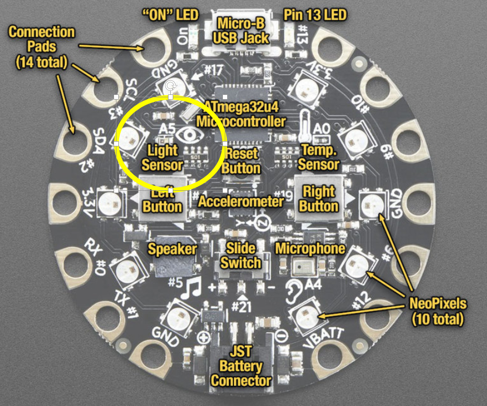

# Use the light sensor in an Adafruit Circuit Playground as an input device in a Processing program
In this Arduino lab you will write a program that gets input from the light sensor in the [Adafruit Circuit Playground](https://www.adafruit.com/product/3000) and uses it as an controller for a Processing program

### Step 1: Plug in the Adafruit Circuit Playground and start Processing
Connect the Circuit Playground to your computer with a USB cord. Open Processing. You will need to install a library (you only need to do this once). Choose *Sketch | Import Library | Add Library*.  Type *Arduino* in the text field labeled *Filter*. Choose *Arduino (Firmata)* and click *Install*.

### Step 2: Run this sample program
Copy and paste the following program
```java {.line-numbers}
import processing.serial.*;
import cc.arduino.*;
Arduino arduino;

public void setup() {
  size(500, 500);
  arduino = new Arduino(this, Arduino.list()[0], 57600); //change the [0] to a [1] or [2] etc. if your program doesn't work
}

public void draw() {
  background(192);
  int y = arduino.analogRead(5);
  System.out.println(y);
  ellipse(250, 2*y, 50, 50);
}
```
Run the program. Pass your hand over the light sensor labeled with a picture of an eye on the Circuit Playground. You should see an ellipse move up and down as the light sensor changes values. Higher values mean more light. The light sensor is circled in the picture below. On some machines, you may need to change the last line in `setup()` to get the program to work correctly.


### Step 3: Write your own program
Using the sample program as a guide, write your own program that uses the light sensor. Your program doesn't have to work or look like any other. Have fun and be creative! 

### Step 4: Make a short (under 10 second) video
When you are happy with your program, have a friend make short video less than 10 seconds in length of you interacting with your virtual pet. Convert the video to an animated gif using a free converter like [ezgif.com](https://ezgif.com/). Submit the .gif file to Google Classroom. See Mr. Simon's example animated gif below.

<!-- ### Have something cool that can be shown at back to school night?
Back to school night is Thursday September 19. Let me know if I can use your program at back to school night.   -->

Samples of Student Work
-----------------------
[Mr. Simon's virtual pet penguin animated gif](https://gifyu.com/image/GaWB)   


